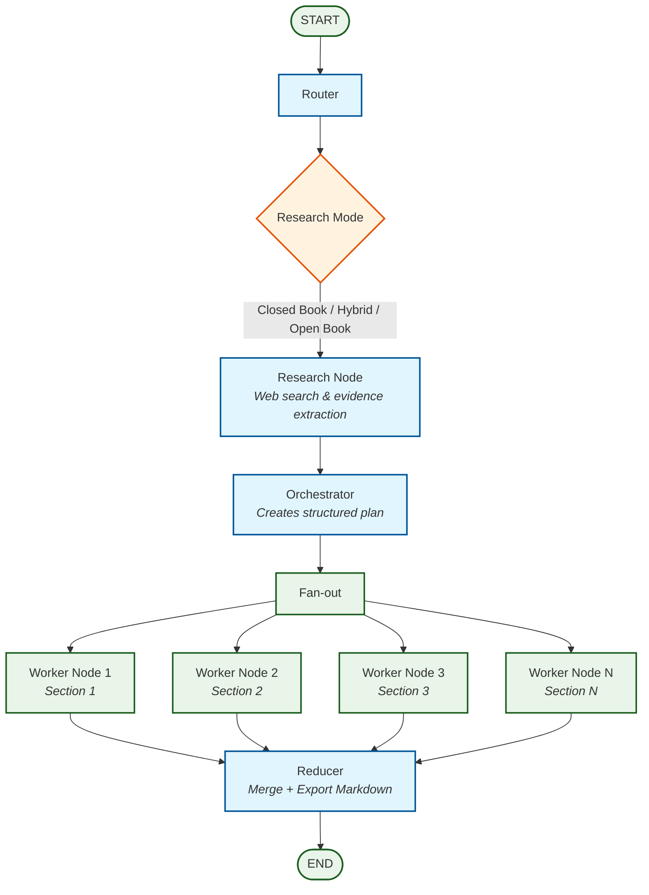

# ScholarAI Writer Agent

<p align="center">
  
  
  
</p>

<p align="center">
  <b>An autonomous research-driven technical blog generation agent built using structured planning, routing, and multi-step LLM orchestration.</b>
</p>

## 🚀 Overview

ScholarAI Writer Agent is a LangGraph-powered autonomous writing system that transforms a single topic query into a fully structured, well-researched, multi-section technical blog post.

**It is not a simple prompt wrapper.** It performs:

- **Routing** → Determines whether research is required
- **Web Research** (if needed) → Retrieves and deduplicates evidence
- **Structured Planning** → Generates a high-quality blog blueprint
- **Parallel Section Writing** → Writes sections independently
- **Reduction & Compilation** → Produces a final polished Markdown article

This architecture ensures grounded, structured, and production-quality long-form outputs.



### Graph-Oriented Orchestration

Built using:
- **LangGraph** for deterministic state transitions
- **LangChain** structured output parsing
- **Groq** LLM inference
- **Tavily API** for external research grounding

## 🏗 Core Components

### 1️⃣ Router Node
Determines:
- Does this topic require fresh web research?
- Is it evergreen (closed-book) or time-sensitive (open-book)?

### 2️⃣ Research Node
- Executes high-signal web queries
- Deduplicates URLs
- Extracts structured evidence objects
- Avoids hallucinated dates or claims

### 3️⃣ Orchestrator
Produces a strongly-typed Plan object:
- 5–9 structured sections
- Explicit goals
- Concrete bullet breakdowns
- Target word counts
- Flags for citations / code inclusion

### 4️⃣ Worker Nodes (Parallelized)
Each worker:
- Writes exactly one section
- Follows bullet structure strictly
- Respects research/citation rules
- Includes code when required

### 5️⃣ Reducer
- Orders sections
- Compiles final Markdown
- Writes output file automatically

## 🔍 Intelligent Research Modes

| Mode | Description |
|------|-------------|
| `closed_book` | Evergreen conceptual topics |
| `hybrid` | Mix of evergreen + recent tools/models |
| `open_book` | News, rankings, recent releases |

The agent automatically decides the mode before planning.

## 📦 Example Usage

```python
out = run("Write an Essay on the newly published research paper about VL-JEPA by Yann LeCun.")
print(out["final"])
```

**Output:**
- Structured Markdown blog
- Grounded citations (if needed)
- Multi-section format
- Saved automatically as `.md`


